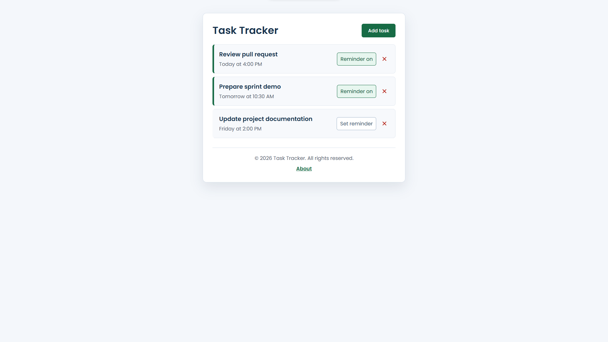
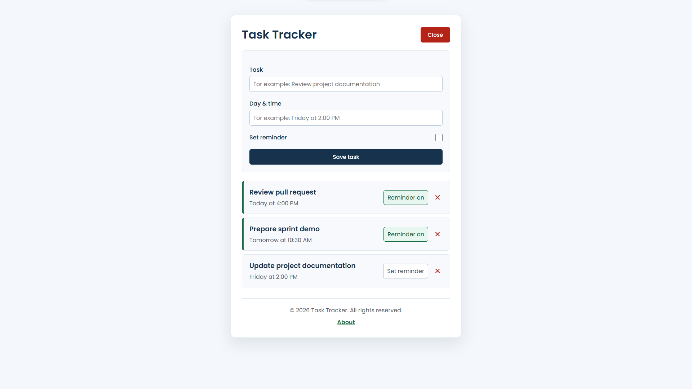

# Task Management Angular App

A responsive Angular task tracker for creating, deleting, and prioritizing everyday tasks through a local REST API.

## Screenshots

### Task dashboard

### Add-task form

## Highlights

- Create and delete tasks
- Toggle reminder status with accessible controls
- Show or hide the task form
- Validate required task information
- Responsive layout for desktop and mobile screens
- Typed Angular services and RxJS state
- Local JSON Server REST API
- Unit tests for components, services, state, and HTTP requests
- Automated GitHub Actions test and build workflow

## Technology

- Angular 22
- TypeScript 6
- RxJS
- JSON Server
- Font Awesome
- Vitest
- GitHub Actions

## Project structure

- `.github/workflows/ci.yml` — automated tests and production build
- `src/app/components` — user-interface components
- `src/app/services` — HTTP and UI-state services
- `src/environments` — development and production API URLs
- `db.json` — local demonstration data
- `angular.json` — Angular workspace configuration
- `package.json` — scripts and dependencies
